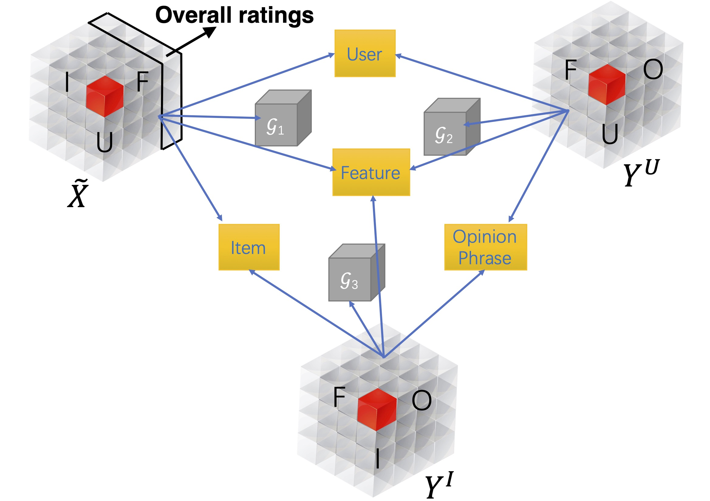

# MTER
[MTER: Explainable Recommendation via Multi-Task Learning in Opinionated Text Data](https://arxiv.org/pdf/1806.03568.pdf), SIGIR'18

This is a parallel implementation of MTER based on the idea of parameter server. The number of processes can be configured for training efficiency depending on the computation capacity. 

## Model


**MTER** focuses on explaining factorization-based recommendation algorithms by taking a holistic view of item recommendation and sentiment analysis. It uses a joint tensor factorization solution to integrate two complementary tasks of *user preference modeling for recommendation* and *opinionated content modeling for explanation*, i.e., a multi-task learning approach. 

The task of item recommendation is modeled by a three-way tensor over user, item and feature, to describe users' preferences on individual items' features, constructed by feature-level sentiment analysis in opinionated review content. The companion task of opinionated content analysis is modeled by another two three-way tensors, one over user, feature, opinionated phrase, and another over item, feature, opinionated phrase, both of which are constructed from user-generated review content. Via a joint factorization over these three tensors, we map users, items, features and opinionated phrases to a shared latent representation space. Item recommendation can be performed by projecting items onto the space spanned by the user factors; and explanations at different levels of granularity can be generated by projecting the features and opinionated phrases onto the space jointly spanned by the user and item factors. Cursed by the high dimensionality, sparsity is a serious issue in both learning tasks; our joint factorization method alleviates this challenge by exploiting relatedness between these two companion tasks. 

## Usage

[Download](https://drive.google.com/drive/folders/1BYyyJW8BBl13KP4W9pxVCvw13CHVOrsV?usp=sharing "yelp data") the processed Yelp review dataset in a folder called `yelp_recursive_entry/`. 

The provided training and testing set are split from `yelp_recursive.entry` for testing the model. Split `yelp_recursive.entry` for different train/validate/test settings. 

Train model: `python MTER_tripletensor_tucker.py --options XXX` 

| option        | default     | description |
| -----------   | ----------- | ----------- |
| -u, --useremb | 15       | user embedding dimension |
| -i, --itememb | 15       | item embedding dimension |
| -f, --featemb | 12       | feature embedding dimension |
| -w, --wordemb | 12       | opinion embedding dimension |
| --bpr | 10       | weight of BPR loss |
| --iter | 200,000       | number of training iterations |
| --lr | 0.1       | initial learning rate for adagrad |
| --nprocess | 4       | number of processes for multiprocessing |

The learned model parameters are stored in the folder 'results'. 

## Citation
If you find this useful for your reserach, please cite:
```
@inproceedings{Wang:2018:ERV:3209978.3210010,
 author = {Wang, Nan and Wang, Hongning and Jia, Yiling and Yin, Yue},
 title = {Explainable Recommendation via Multi-Task Learning in Opinionated Text Data},
 booktitle = {The 41st International ACM SIGIR Conference on Research \&\#38; Development in Information Retrieval},
 series = {SIGIR '18},
 year = {2018},
 isbn = {978-1-4503-5657-2},
 location = {Ann Arbor, MI, USA},
 pages = {165--174},
 numpages = {10},
 url = {http://doi.acm.org/10.1145/3209978.3210010},
 doi = {10.1145/3209978.3210010},
 acmid = {3210010},
 publisher = {ACM},
 address = {New York, NY, USA},
 keywords = {explainable recommendation, multi-task learning, sentiment analysis, tensor decomposition},
} 
```
